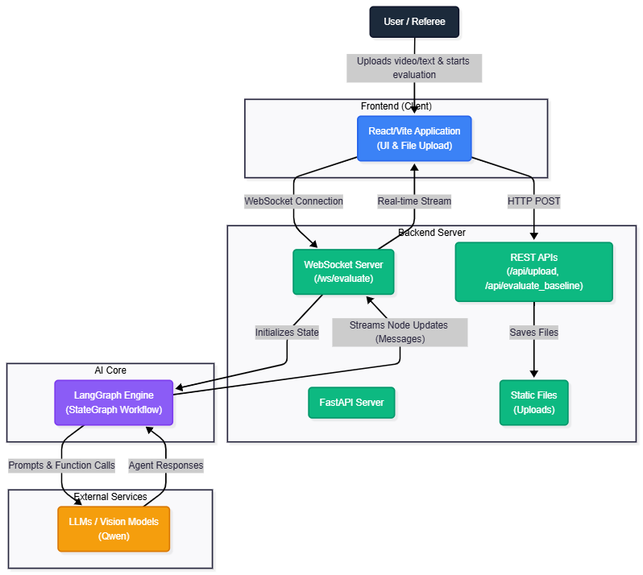
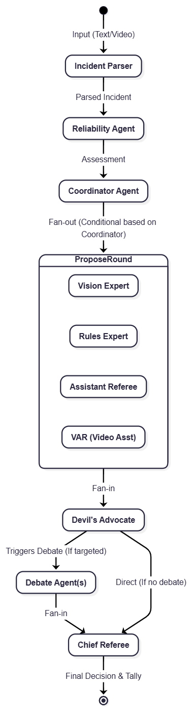
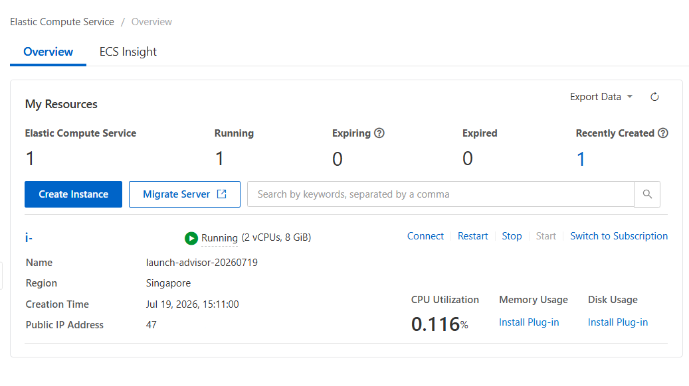

# Multi-Agent System Referee

Welcome to the **Multi-Agent System Referee** project! This system is a state-of-the-art Multi-Agent AI system designed to evaluate and referee football (soccer) incidents using a group of AI specialist agents. The system utilizes real-time streaming, a decoupled frontend/backend architecture, and a complex graph-based agent workflow.

### Why This System Was Built
While initially inspired by specific tournaments (like the CAN), this system is built for **football in general**. The goal is to provide a transparent, fair, and highly accurate AI-driven evaluation of on-field incidents by simulating a real-world refereeing team, standardizing decisions across any league or match.

### Hackathon Track
This project was developed as part of the **Global AI Hackathon Series with Qwen Cloud**, specifically targeting the following track:
> **Agent Society:** Design multi-agent systems that collaborate, negotiate, or compete in shared environments.

This README explains the system architecture step-by-step and highlights the core agent workflows.

---

## 1. High-Level System Architecture
**Diagram Reference:** [archi.mmd](./archi.mmd)

The overall system is built on a modern client-server architecture, allowing users to upload match incidents (text or video) and watch the AI agents deliberate in real-time.

### Step-by-Step Flow:
1. **Frontend (React/Vite)**: The user accesses a web UI to upload a text description or a video of a match incident.
2. **REST API (FastAPI)**: The frontend sends the initial request via a standard HTTP POST request to the backend endpoints (e.g., `/api/upload`). The backend stores any uploaded media in the local static files directory.
3. **WebSocket Connection**: To handle the continuous stream of debates and thoughts generated by the AI, the frontend opens a persistent WebSocket connection (`/ws/evaluate`) with the backend.
4. **LangGraph Engine**: The backend initializes a State Graph using LangGraph, passing the parsed input state. 
5. **Real-time Streaming**: As the LangGraph Engine triggers LLM prompts and functions, it continuously streams the internal thoughts, agent messages, and state updates back to the UI through the WebSocket.
6. **External LLM Services**: The core reasoning is powered by external LLM services (like Qwen or OpenAI models), which receive context from the backend and return structured agent responses.

---

## 2. Multi-Agent System (MAS) Core Workflow
**Diagram Reference:** [mas_workflow.mmd](./mas_workflow.mmd)

The true intelligence of the system lies in its LangGraph state machine (`backend/graph.py`), which orchestrates a panel of AI "specialists" to evaluate the incident, debate dissenting opinions, and reach a final verdict.

### Step-by-Step Flow:
1. **Incident Parser**: The process starts when the raw video/text is passed to the `Parse` node. The system uses a vision/LLM model to extract structured data (e.g., players involved, location, point of contact).
2. **Reliability Agent**: The parsed incident is then reviewed by the `Reliability` node to determine how trustworthy the parsed data is compared to the overall context.
3. **Coordinator Agent**: Based on the incident data and its reliability, the `Coordinator` decides which specialized agents need to be invoked to assess the play.
4. **Propose Round (Parallel Fan-out)**: The system dynamically branches out to specialized agents:
   - **Vision Expert**: Analyzes visual evidence.
   - **Rules Expert**: Evaluates the action against the official rulebook.
   - **Assistant Referee**: Gives an on-field perspective (e.g., offsides, out-of-bounds).
   - **VAR (Video Assistant Referee)**: Makes recommendations based on video analysis.
5. **Devil's Advocate (Fan-in)**: Once all specialists provide their initial opinions, the graph converges at the `Devil's Advocate`. This agent actively looks for logical flaws, contradictions, or missed rules in the specialists' opinions.
6. **Debate Phase**: If the Devil's Advocate finds an issue, it targets specific agents, triggering the `Debate` node. The targeted agents formulate rebuttals, adjusting their confidence levels based on the critique. If no issues are found, the debate phase is bypassed.
7. **Chief Referee**: Finally, all opinions, vote tallies, and debate outcomes converge at the `Chief Referee`. This ultimate authority synthesizes the information and declares the final refereeing decision.

## Proof of deployment 

