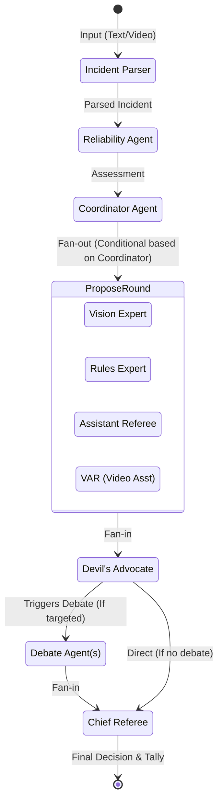

# CAN Refereeing AI Solutions - System Architecture

This document provides a clear visual representation of the overall system architecture, including the client-server interaction and the detailed multi-agent workflow powered by LangGraph.

## High-Level System Architecture

The application is built using a modern decoupled architecture, where a React-based frontend communicates with a FastAPI backend. The backend manages the core AI logic, coordinating multiple language models through a state graph.

```mermaid
graph TD
    %% Define Styles
    classDef frontend fill:#3b82f6,stroke:#2563eb,stroke-width:2px,color:#fff,rx:5px,ry:5px;
    classDef backend fill:#10b981,stroke:#059669,stroke-width:2px,color:#fff,rx:5px,ry:5px;
    classDef aiEngine fill:#8b5cf6,stroke:#7c3aed,stroke-width:2px,color:#fff,rx:5px,ry:5px;
    classDef external fill:#f59e0b,stroke:#d97706,stroke-width:2px,color:#fff,rx:5px,ry:5px;
    classDef client fill:#1e293b,stroke:#0f172a,stroke-width:2px,color:#fff,rx:5px,ry:5px;

    %% Nodes
    User([User / Referee]):::client
    
    subgraph "Frontend (Client)"
        UI["React/Vite Application<br/>(UI & File Upload)"]:::frontend
    end

    subgraph "Backend Server"
        FastAPI["FastAPI Server"]:::backend
        StaticFiles["Static Files<br/>(Uploads)"]:::backend
        APIEndpoints["REST APIs<br/>(/api/upload, /api/evaluate_baseline)"]:::backend
        WSEndpoint["WebSocket Server<br/>(/ws/evaluate)"]:::backend
    end

    subgraph "AI Core"
        LangGraph["LangGraph Engine<br/>(StateGraph Workflow)"]:::aiEngine
    end

    subgraph "External Services"
        LLM["LLMs / Vision Models<br/>(OpenAI, Anthropic, Qwen, etc.)"]:::external
    end

    %% Relationships
    User -->|Uploads video/text & starts evaluation| UI
    UI -->|HTTP POST| APIEndpoints
    APIEndpoints -->|Saves Files| StaticFiles
    UI -->|WebSocket Connection| WSEndpoint
    WSEndpoint -->|Real-time Stream| UI
    
    WSEndpoint -->|Initializes State| LangGraph
    LangGraph -->|Streams Node Updates (Messages)| WSEndpoint
    
    LangGraph -->|Prompts & Function Calls| LLM
    LLM -->|Agent Responses| LangGraph
```

> [!NOTE] 
> The client uses WebSockets (`/ws/evaluate`) to receive real-time updates as each agent in the graph completes its processing. This powers a dynamic user interface where debates and analyses are streamed live.

<br/>

## Multi-Agent Workflow (LangGraph)

The core logic of the application relies on a LangGraph state machine (`backend/graph.py`). This dictates how the various AI "specialists" collaborate, debate, and arrive at a final refereeing decision.



### Agent Roles & Flow Breakdown

1. **Parse / Coordinate Phase**:
   - **Incident Parser**: Extracts structured data (players involved, location, contact points) from either raw text or video (using Qwen).
   - **Reliability Agent**: Evaluates how trustworthy the parsed data is compared to the context provided.
   - **Coordinator**: Determines which specialist agents need to be launched for the specific incident type.

2. **Propose Round (Parallel Processing)**:
   - The coordinator launches a subset of the specialists (`Vision`, `Rules`, `Asst Ref`, `VAR`). Each evaluates the parsed incident based strictly on their designated perspective.

3. **Critique & Debate Phase**:
   - **Devil's Advocate**: Acts as a fan-in point to review the initial opinions of the specialists. It intentionally looks for flaws and can trigger a debate by challenging specific agents.
   - **Debate Agent**: The targeted agents formulate rebuttals to the Devil's Advocate's critique, adjusting their confidence levels based on the interaction.

4. **Decision Phase**:
   - **Chief Referee**: Consolidates all initial opinions, computed vote tallies, and the debate outcomes to declare the final, authoritative ruling on the incident.
